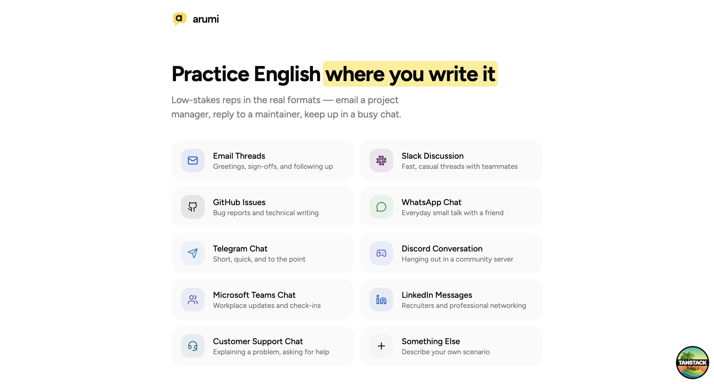

<p align="center">
  
</p>

# Inklish

Practice English where you write it. Inklish gives you low-stakes reps in the real formats: email a project manager, reply to an open-source maintainer, keep up in a busy group chat.

Instead of flashcards or generic chatbot windows, you practice inside rooms that look and feel like the real thing: email threads, Slack, GitHub issues, WhatsApp, Telegram, Discord, Teams, LinkedIn, and customer support chats. An AI persona plays the other side of the conversation. A coach reads every message you send and helps you sound natural.

And it's BYOK: bring your own OpenRouter key and it's yours to run. Swap models from the admin panel (cheap-and-fast through frontier), watch exactly what every user costs you, and pay the provider directly. No markup, no lock-in.

## How it works

1. **Pick a scene.** Ten formats, from formal email threads to casual chats, or describe your own scenario.
2. **Prepare.** A short interview (one question at a time, three follow-ups max) turns your situation into a concrete scenario and a conversation partner.
3. **Write.** The persona replies in character, in the register of the platform: crisp in email, fast and casual in chat.
4. **Get coached.** Each message you send comes back marked up: grammar fixes, tone notes, and a more natural rewrite when yours reads stiff. Strong phrasing from the persona gets flagged as worth stealing.

Sign-in is Google only. Every account gets a free daily message allowance (30 by default, configurable), and an admin dashboard at `/admin` shows per-user usage, tokens, and cost, plus controls for models, prompts, and limits.

## Stack

- [Convex](https://convex.dev) for the database, auth, and AI actions
- [OpenRouter](https://openrouter.ai) for models, hot-swappable from the admin panel
- React 19, Vite, and [TanStack Router](https://tanstack.com/router)
- Tailwind CSS with shadcn/ui, Biome, Bun

## Running it yourself

You need [Bun](https://bun.sh), a free [Convex](https://convex.dev) account, an [OpenRouter](https://openrouter.ai) API key, and Google OAuth credentials.

```bash
bun install
bunx convex dev   # creates a dev deployment and writes .env.local
```

Configure the backend. These live on the Convex deployment, not in a local file:

```bash
bunx convex env set OPENROUTER_API_KEY sk-or-...
bunx convex env set ADMIN_EMAIL you@example.com
bunx convex env set AUTH_GOOGLE_ID your-client-id.apps.googleusercontent.com
bunx convex env set AUTH_GOOGLE_SECRET your-client-secret
bunx convex env set SITE_URL http://localhost:3000
```

For the Google credentials, create an OAuth client (web application) in the [Google Cloud console](https://console.cloud.google.com/apis/credentials) and add this authorized redirect URI, using the deployment name `bunx convex dev` printed:

```
https://<your-deployment>.convex.site/api/auth/callback/google
```

Then start the app in a second terminal:

```bash
bun run dev
```

Open http://localhost:3000, sign in with Google, and start a session. The account matching `ADMIN_EMAIL` sees `/admin`; everyone else gets a 404 there.

## Scripts

| Command | What it does |
| --- | --- |
| `bun run dev` | Vite dev server on port 3000 |
| `bunx convex dev` | Convex dev deployment with live push |
| `bun run build` | Production build |
| `bun run test` | Vitest |
| `bun run check` | Biome lint + format |

## Contributing

Issues and pull requests are welcome. See [CONTRIBUTING.md](CONTRIBUTING.md) for setup and conventions.

## License

[MIT](LICENSE)
